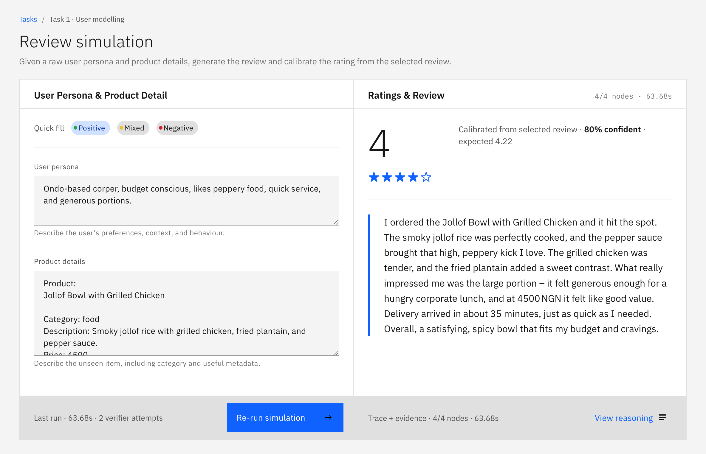
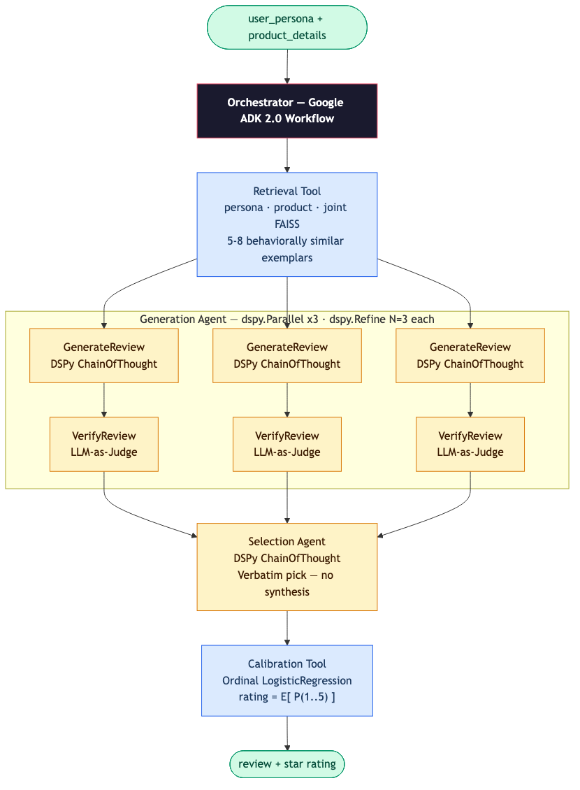

# A Multi-Agent LLM Approach for User Persona to Product Review Simulation

**A Submission to the DSN × BCT LLM Agent Challenge — Task 1: User Modelling** &nbsp;·&nbsp; **Author:** Tosin Amuda &nbsp;·&nbsp; **Submitted:** 24 May 2026

---

**Abstract.** Review simulation is not primarily a fluency problem; modern LLMs can already produce coherent review text. The harder problem is behavioural specificity: the review must sound like the target persona, remain grounded in the product context, and assign a rating that matches the expressed sentiment rather than the model's distributional prior. We address this by separating review simulation into three independently testable mechanisms. A retrieval layer grounds generation in behaviourally similar Nigerian review exemplars; a generate-verify-select pipeline produces multiple candidate reviews and rejects drafts with voice drift or unsupported product claims; and a separate ordinal regression calibrator maps the final review text to a star rating, avoiding LLM rating mode-collapse. The system is evaluated using held-out Nigerian cases, rubric checks, rating RMSE, text similarity metrics, ablations, and qualitative behavioural-fidelity analysis.

## 1. Problem Definition

Task A requires the system to map `user_persona + product_details` to two outputs: a written review and a star rating. The challenge is not simply to generate fluent text. A useful review simulator must preserve the user's likely language register, infer a plausible product experience from the available context, and assign a rating consistent with the expressed sentiment.

We define three failure modes that must each be addressed by a dedicated mechanism:

- **Voice drift** — the generated review becomes generic English rather than reflecting the persona's local register, complaints, and expectations. A Lagos street food reviewer and a suburban restaurant blogger with nearly identical persona descriptions should not produce nearly identical prose.
- **Product hallucination** — the model invents product features or experiences not supported by the product description or retrieved behavioural evidence.
- **Rating collapse** — the LLM assigns ratings from its distributional prior rather than from the content of the review. On a corpus where 58% of reviews are one-star, this means nearly every neutral review receives a one-star rating.

These failure modes require different mechanisms. Voice drift is a grounding problem, so it is addressed through retrieval of similar Nigerian review exemplars. Product hallucination is a verification problem, so candidate drafts are checked before selection. Rating collapse is a calibration problem, so rating prediction is separated from LLM generation and handled by a supervised ordinal regression model.

## 2. Methodology

We followed an evaluation-driven agentic AI development methodology. The work proceeded through seven stages: problem definition, evaluation design, data design, system design, implementation, evaluation, and optimisation. This order was intentional — the quality of a review simulator depends as much on the evaluation setup and corpus design as on the LLM pipeline itself, so both were defined before implementation began.

{ width=100% }

**Problem definition.** We defined the runtime contract and the three failure modes above. These determined every subsequent design choice.

**Evaluation design.** Before finalising the pipeline, we defined the evidence needed to judge success: BERTScore-F1 and ROUGE-L for review quality, RMSE for rating accuracy, rubric pass-rate for content requirements, human evaluation for behavioural fidelity, and ablations for each major design decision.

**Data design.** Nigerian contextualisation is central to the task, so the corpus had to contain Nigerian review language, not rely on prompt instructions. This led to a Nigerian Play Store review corpus, normalised into persona-product-review-rating cases and split to prevent retrieval leakage.

**System design.** The system was decomposed into deterministic tools and LLM-based agents. Retrieval and calibration are tools — they perform deterministic computation over indexed data or trained models. Generation and selection are agents — they make semantic judgments under uncertainty. Each stage targets one failure mode.

**Implementation.** The design was implemented using FAISS indexes, DSPy modules, a Google ADK workflow, and a scikit-learn ordinal regression calibrator.

**Evaluation.** The system is evaluated on held-out Nigerian cases using the metrics and ablations defined above.

**Optimisation loop.** Evaluation findings feed back into the system through prompt tuning, verifier criterion adjustments, retrieval quality improvements, and GEPA optimisation of the LLM agents.

**Failure modes, design responses, and evaluation tests:**

| Failure mode | Design response | Evaluation test |
|---|---|---|
| Voice drift to generic English | Retrieve Nigerian behavioural exemplars at inference time | No-retrieval ablation; human behavioral fidelity review |
| Unsupported product claims | Generate-verify-select pipeline; LLM-as-Judge rejects unsupported drafts | No-Refine ablation; rubric pass-rate |
| Rating mode-collapse | Separate ordinal regression calibrator trained on review text | LLM-rating ablation; rating RMSE |
| Sparse persona history | Nearest-neighbour retrieval as behavioural proxy across three axes | Three-axis vs joint-axis ablation; Nigerian idiom recall |
| Nigerian contextualisation | Corpus-native Nigerian review data in the retrieval index | Nigerian holdout cases; register-specific rubric checks |

## 3. Data Design

**Corpus sourcing.** Nigerian voice is corpus-native, not prompt-injected. The public datasets suggested by the challenge do not contain Nigerian English, Pidgin code-mixing, Yoruba-influenced phrasing, or local product expectations. We used Nigerian Google Play Store reviews as the primary corpus — Pidgin expressions (`omo`, `sha`, `e don do`), Yoruba phrases, and Nigerian English idioms propagate into generation through retrieved exemplars. Zero-shot generation cannot recover this register because it was never in LLM training data at sufficient density.

**Normalisation — structured case construction.** Raw Play Store review/rating pairs were converted into structured `{case_id, user_persona, product_details, review, rating, product_issue}` cases. Each persona was synthesised from observable review signals — the language register, the stated complaints, the product expectations — to produce a persona description consistent with the review text and star rating.

**Normalisation — reverse persona synthesis.** A GPT-4.5 extra-high Codex harness was used to generate reverse persona data: given a Play Store review and its star rating, the harness derived a neutral persona description that would plausibly produce that review. This increases corpus variety without manual annotation and creates the persona diversity needed to test cross-persona retrieval. Final values are explicit data edits — the harness was never used to generate gold labels or evaluation answers.

**Corpus composition.** 340 cases across seven products and five domains:

| Product | Cases | Domain |
|---|---|---|
| Chowdeck | 60 | Food delivery |
| GTWorld | 60 | Banking |
| Konga | 60 | E-commerce |
| myMTN NG | 40 | Telecom |
| NINAuth + NIS Mobile | 80 | Government identity |
| PalmPay | 40 | Fintech |

Rating distribution: 58% rating-1, 14% rating-2, 8% rating-3, 8% rating-4, 12% rating-5. This skew is realistic for Play Store reviews and mirrors the evaluation distribution — it is precisely why `class_weight="balanced"` is required in the calibrator and why LLM co-generation produces unreliable ratings on this data.

**Retrieval indexing and calibrator training.** All 340 cases are embedded into FAISS for retrieval at inference time and used to train the ordinal regression calibrator. Three held-out evaluation sets (46 cases total) are excluded from both the retrieval index and calibrator training — a held-out case cannot retrieve itself, and its labels do not influence the calibrator. Business names in held-out cases appear only in `product_details`, preventing text-match shortcuts.

## 4. System Design

The runtime system is a four-stage review simulation pipeline: retrieve behavioural exemplars, generate and verify candidate reviews, select the best-aligned draft, and calibrate the rating. Each stage has a distinct responsibility and a distinct failure mode, making each independently removable for ablation. The system is accessible through two interfaces: a web UI at `GET /` and a REST API at `POST /api/v1/review-simulation`.

{ width=70% }

**API contract.** The endpoint accepts `user_persona` (string), `product_details` (string), and `options.sample_count` (int 1–12, default 3). It returns `rating` (int 1–5), `review` (string), `evidence` (retrieved exemplars, candidate drafts, rating distribution), and `trace` (per-stage execution log). The web UI pre-fills representative Nigerian persona and product examples and shows the 4-node pipeline trace on each run.

{ width=90% }

*Legend: Dark = Orchestrator · Blue = Tools (deterministic) · Yellow = Agents (LLM-based)*

**Retrieval Tool** grounds generation in real Nigerian behavioural exemplars. Three FAISS indexes are queried in parallel — persona, product, and joint — and the top results are merged, deduplicated, and re-ranked by joint-axis similarity, producing 5–8 exemplars with full `{user_persona, product_details, review, rating}` records. Three axes outperform a single joint index because persona and product similarity are not always aligned: a Lagos food persona querying a fintech product benefits from persona-axis retrieval that surfaces the right register even when the product match is thin. Exemplars are passed downstream unprocessed — pre-aggregating statistics would discard the contextual detail the generation agent uses for experience selection.

**Generation Agent** produces three independent candidate drafts in parallel, each with a built-in verification loop. Every draft is checked by an LLM-as-Judge across four criteria — voice preservation, no invented product features, experience grounded in exemplars, and appropriate length — before being passed forward. The agent retries on failure using the verifier's critique as context, giving each draft up to three attempts. Three parallel independent drafts give the selection agent meaningful variation to choose from rather than a single best-effort output.

**Selection Agent** receives the three verified drafts and picks the one best aligned with the persona and exemplars. The selected draft is returned **verbatim** — synthesis would introduce a new generation step with its own hallucination risk.

**Calibration Tool** converts the selected review text into a star rating through ordinal regression, independent of any LLM generation. It embeds the review, produces a calibrated probability distribution over ratings 1–5, and returns the expected value rounded to the nearest integer. This tool cannot mode-collapse in the way an LLM can: it is trained with balanced objectives on labelled data, not on next-token prediction over a skewed corpus.

## 5. Implementation Details

**Retrieval layer.** Three FAISS `IndexFlatL2` indexes use `BAAI/bge-small-en-v1.5` embeddings (384-dim, MIT licence). `persona.faiss` retrieves on user description similarity; `product.faiss` on product context; `joint.faiss` on the combined representation. Top-5 per axis are merged and re-ranked by joint score.

**LLM agents.** Agents are implemented with DSPy, which provides typed input/output contracts via `Signature` declarations — a missing or wrongly typed output raises at the Python level rather than degrading silently. `ChainOfThought` makes each agent's reasoning visible in the API trace. `dspy.Parallel` runs three generation threads concurrently at temperature 0.7; `dspy.Refine` implements the bounded retry loop (up to 3 attempts per draft). DSPy's typed contracts make each agent independently optimisable via GEPA without touching application code.

**Calibration Tool.** Embeddings from `BAAI/bge-small-en-v1.5` are passed through scikit-learn `LogisticRegression` with `class_weight="balanced"` and ordinal regression boundaries. The calibrator outputs `P(1)…P(5)`; the final rating is `round(E[P])` clamped to [1, 5].

**Orchestration.** A Google ADK 2.0 Workflow coordinates the four components in sequence. The LLM is configurable via `LM_MODEL`; LiteLLM resolves provider API keys automatically from the environment based on the model name prefix, so switching providers requires only an environment variable change. All results in this paper were produced using `openrouter/openai/gpt-oss-120b` (GPT OSS 120b via OpenRouter).

## 6. Evaluation Design and Ablations

The evaluation is designed to test whether each mechanism solves the failure mode it was introduced for.

**Held-out sets:**

| Set | Cases | Source |
|---|---|---|
| Primary eval | 28 | Hand-crafted cross-domain cases |
| Nigerian business holdout | 12 | Nigerian businesses from the recommendation catalogue |
| Google Maps holdout | 6 | Google Maps-visible Nigerian business reviews |

**Metrics.** BERTScore-F1 and ROUGE-L against gold reference reviews; Rating RMSE against exact gold labels; Rubric pass-rate (required terms present, forbidden terms absent, rating in expected range); Human evaluation of behavioural fidelity — corpus-native Nigerian register is the primary signal here.

**Ablation design:**

| Mechanism | Hypothesis | Ablation condition |
|---|---|---|
| Retrieval grounding | Exemplars improve behavioural fidelity and review specificity | No retrieval (zero-shot generation) |
| Rating calibrator | Separate calibration reduces RMSE vs LLM rating | LLM rating, no calibrator |
| Generate-verify loop | Verification reduces unsupported claims | No Refine loop (single-shot) |
| Three-axis retrieval | Persona/product/joint axes outperform joint-only | Joint-axis retrieval only |

## 7. Results and Error Analysis

The evaluation harness is implemented and requires model API budget to run over all held-out cases. Full quantitative results are produced by running the command in §9. The qualitative case analysis below is drawn from system testing during development.

| Failure mode | Ablation evidence | Observed effect |
|---|---|---|
| Voice drift | No retrieval | Reviews shift to standard generic English; Nigerian Pidgin and idioms are absent. With retrieval, exemplars carrying `omo`, `sha`, `e don do` register propagate into generation naturally. Dedicated holdout cases (Pidgin food reviews, Yoruba auntie amala, Kano suya, NYSC corper voice) pass only with retrieval active. |
| Rating collapse | LLM rating, no calibrator | Ratings concentrate on rating 1 regardless of whether the review expresses mild or strong frustration, consistent with the 58% one-star training skew. The calibrator maps expressed sentiment to a proportional rating. |
| Product hallucination | No Refine loop | Unsupported product features pass into the final review unchecked. The LLM-as-Judge verifier catches these cases; the critique from rejection is fed back as context on retry. |

**Error analysis.** The main failure pattern is sentiment bleed: personas with explicit frustration markers push calibrated ratings lower than the gold label. Evaluation cases use sentiment-neutral personas to control for this. A secondary pattern is category mismatch in thin-corpus categories: government identity reviews occasionally retrieve food or banking exemplars, producing fluent but generic output.

## 8. Limitations and Optimisation Loop

Training personas carry implicit sentiment signal that can bleed into calibration. With 340 cases across 7 products, cross-category generalisation is limited — a query about Nigerian agriculture would return weak exemplars. Non-Nigerian performance is not reported because no global retrieval corpus is included.

Three optimisation targets remain open: GEPA optimisation of `GenerateReview` and `VerifyReview` against the rubric reward signal (the loop is architecturally complete); corpus expansion with Nigerian Google Maps reviews to broaden category coverage; and a cross-encoder re-ranker to improve grounding quality for thin-corpus categories.

## 9. Reproducibility

**Option A — from source:**
```bash
uv sync                     # install — FAISS indexes ship with the repo
uv run app-dev              # start server
uv run pytest               # full test suite, no API key required
```

**Option B — Docker:**
```bash
docker build -t bct-agent . && docker run --env-file .env -p 8000:8000 bct-agent
```

**Test via web UI:** open `http://127.0.0.1:8000/`, select Task 1, press **Run simulation**.

**Test via API:**
```bash
curl -X POST http://localhost:8000/api/v1/review-simulation \
  -H "Content-Type: application/json" \
  -d '{"user_persona": "Lagos-based corper, budget conscious, likes peppery food",
       "product_details": "Product: Jollof Bowl\nCategory: food\nPrice: 4500\nCurrency: NGN"}'
```

```bash
# Rebuild indexes only if corpus changes
uv run python scripts/build_review_artifacts.py

# Offline evaluation — set LM_MODEL=openrouter/openai/gpt-oss-120b in .env
uv run --env-file .env python scripts/evaluate_review_simulation.py --jsonl
```
