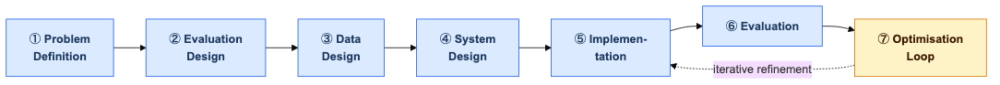

# A Multi-Agent LLM Approach for Persona-Driven Product Recommendation

**A Submission to the DSN × BCT LLM Agent Challenge — Task 2: Recommendation** &nbsp;·&nbsp; **Author:** Tosin Amuda &nbsp;·&nbsp; **Submitted:** 24 May 2026

---

**Abstract.** Task B asks for personalised recommendations from user personas, including cold-start, cross-domain, and contextual scenarios. We approached this first as a persona-driven retrieve-and-rank problem: retrieve candidate items using product similarity and similar-persona signals, then rank them according to the user's stated context. Initial evaluation showed a key failure mode — the system could produce plausible rankings even when the retrieved candidates were not valid for the user's locale or domain. We therefore introduced an optimisation layer that assesses candidate suitability before ranking. The final system retrieves candidates, judges whether the candidate set is fit to recommend, routes either to catalogue ranking or fallback generation, and validates the final response. This evaluation-driven design preserves ranking behaviour when catalogue coverage is adequate while avoiding confidently wrong recommendations when it is not.

## 1. Problem Definition

Task B requires a system that maps a user persona — and optionally contextual signals such as location, category, budget, or intent — to personalised recommendations. We define the task as persona-based contextual recommendation under sparse behavioural evidence: the system must recommend useful items even when the user has no explicit rating history, the request crosses domains, or the available catalogue is uneven across locales.

The initial challenge was not coverage detection. It was how to combine two weak signals: product similarity and persona similarity. Product similarity helps when the user's request is specific, while persona similarity provides a collaborative signal by surfacing items liked by behaviourally similar users. The first system design used this dual-axis retrieval strategy followed by ranking.

Initial evaluation exposed a second-order failure. The ranker could still assign high scores to candidates that were inappropriate for the user's actual context. This happened most clearly under locale mismatch and cross-domain conditions, where the system produced fluent explanations for items that should not have been recommended at all. The final system therefore adds candidate suitability assessment before ranking — not as the original thesis, but as the most important optimisation found through evaluation.

## 2. Methodology

We followed an evaluation-driven agentic AI development methodology. The project did not begin with a fixed candidate-fit routing architecture. It began with the task requirement — produce personalised recommendations from user personas — and the system was developed through evaluation of failure modes and iterative refinement.

{ width=100% }

**Problem definition.** We defined the recommendation task as persona-based contextual ranking under sparse behavioural evidence. The initial system needed to combine item metadata and similar-persona behaviour because no explicit user-item rating matrix was available.

**Evaluation design.** We defined ranking metrics (NDCG@10, Hit Rate@10) for standard recommendation quality and scenario-based checks for cold-start, cross-domain, and Nigerian-context requests. Scenario tests were critical because NDCG and Hit Rate alone do not reveal whether a recommendation is contextually usable — a US restaurant can score well on relevance metrics if the held-out set allows it.

**Data design.** We combined a broad Yelp-derived catalogue with a hand-curated Nigerian catalogue and persona cases. This was necessary to test both general ranking behaviour and Nigerian contextualisation: a Yelp-only catalogue would make every Nigerian request automatically unsupported, which tests data coverage, not recommendation quality.

**System design.** The initial design used dual-axis retrieval followed by ranking. After evaluation showed that the ranker could confidently score contextually invalid candidates, the system was revised to include candidate suitability judgment, deterministic routing, fallback generation, and response validation. These additions are the product of the optimisation loop, not the original design.

**Implementation.** The final implementation uses FAISS retrieval, DSPy-based reasoning modules, Pydantic output schemas, a Google ADK workflow, deterministic routing, and response validation.

**Evaluation.** The evaluation compares the final system against ablations that remove candidate suitability judgment, similar-persona scoring, dual-axis retrieval, or fallback generation.

**Optimisation loop.** Evaluation findings feed back into the implementation. In this project, the most significant optimisation was adding the candidate suitability layer after observing that retrieve-and-rank alone failed under locale and domain mismatch.

**System evolution and design decisions:**

| Development stage | Observed finding | Design response |
|---|---|---|
| Initial retrieve-and-rank design | Product-axis retrieval alone produced generic results with weak persona alignment | Add persona-axis retrieval as collaborative signal |
| Cold-start testing | Similar-persona evidence sometimes absent for new or niche personas | Keep product-axis retrieval as cold-start fallback |
| Nigerian-context testing | Yelp-heavy retrieval returned plausible but contextually invalid items | Add candidate suitability judgment before ranking |
| Cross-domain testing | Ranker forced weak candidates into the requested context with confident reasoning | Route poor-fit candidate sets to fallback generation |
| Output validation | Generated alternatives could leak rejected candidate names | Add structural validation and name-leakage checks |

## 3. Data Design

**Catalogue sourcing.** The Yelp Academic Dataset is the primary structured source — approximately 5,000 business items across food, banking, fintech, e-commerce, entertainment, and services, with structured fields that embed well. A Yelp-only catalogue, however, would make every Nigerian request automatically route to fallback generation — not because the suitability judgment is working correctly, but because the catalogue genuinely has nothing to offer. This would conflate data coverage failure with system design success. Testing candidate suitability assessment requires a catalogue with genuine Nigerian coverage.

**Nigerian catalogue curation.** A hand-curated sub-catalogue of 96 items was built to cover Lagos at neighbourhood granularity (Yaba, Lekki, Ikeja, VI, Surulere) and five additional cities (Abuja, Port Harcourt, Enugu, Kano, Ibadan). Manual curation is necessary because no large-scale Nigerian service dataset with structured metadata is publicly available. Multi-domain coverage includes food (jollof rice, suya, amala, egusi, pepper soup), banking (GTBank, Access, Zenith, FirstBank), fintech (PalmPay, OPay, Flutterwave), telecoms (MTN, Airtel, Glo, 9mobile), and e-commerce (Konga, Jumia).

**Persona case design.** 459 persona cases (400 Yelp-derived, 59 Nigerian/manual) are embedded into the persona retrieval index. Each case records liked products alongside the persona description, so similar-persona retrieval surfaces products that behaviourally similar users have engaged with. Nigerian persona cases express locale, neighbourhood, and context signals — a Lagos student in Yaba, a Port Harcourt professional, a Kano market trader — so the collaborative signal reflects Nigerian-specific preference structure.

**Retrieval indexing and held-out evaluation.** 100 Yelp-derived persona cases are excluded from the persona index — they cannot retrieve themselves as collaborative signal. Product metadata for those cases remains in the catalogue, so NDCG@10 and Hit Rate@10 rank over the same candidate pool as the runtime. Nigerian persona cases are indexed, which is why Nigerian ranking quality is reported qualitatively in §7–8 rather than as a held-out numeric metric. Data disclosure: embedding model `BAAI/bge-small-en-v1.5` (MIT); LLM configurable via `LM_MODEL`; Yelp data under the Yelp Academic Dataset licence; frameworks Google ADK 2.0, DSPy, LiteLLM, FAISS — all open source.

## 4. System Design

The final system is a five-stage branched pipeline: retrieve candidates, assess candidate suitability, route by the suitability decision, rank or generate, and validate the response. This design emerged after initial retrieve-and-rank evaluation showed that ranking alone could not distinguish between strong candidates and merely available ones. The system is accessible through two interfaces: a web UI at `GET /` and a REST API at `POST /api/v1/recommendations`.

{ width=85% }

**API contract.** The endpoint accepts `user_persona` (string), `context` (string), `category` (string|null), and `k` (int 1–10, default 5). An optional `candidate_items` list bypasses retrieval for explicit re-ranking. The response returns `recommendation_mode` (catalogue_grounded | llm_generated | coverage_limited | request_supplied_candidates), `coverage` (suitability status and decision), `recommendations` (ranked catalogue items with fit_score, headline, and reasoning), `generated_recommendations` (non-catalogue fallback items, excluded from NDCG), and `trace`.

Retrieval produces a candidate set using both persona and product similarity. The Candidate Suitability Judge then assesses whether that set is appropriate for the user's locale, domain, and context. If suitable, the Ranking Agent scores only the approved items. If not, the system routes to fallback generation and clearly labels those outputs as non-catalogue recommendations.

{ width=100% }

*Legend: Dark = Orchestrator · Blue = Tools (deterministic) · Yellow = Agents (LLM-based) · Purple = Router*

**Retrieval Tool** surfaces a diverse candidate set for the suitability judge to evaluate. It queries a persona index and a product index in parallel, boosts candidates from similar personas' liked-product records, and filters by category when specified. Cold-start fallback: when no similar personas exist, the tool falls back to product-axis retrieval only. The suitability judge still runs on the thinner set — cold-start does not bypass the assessment step.

**Candidate Suitability Judge** determines whether the retrieved candidates are appropriate to recommend before ranking begins. It reasons over each candidate against the request locale, domain, and budget, then returns a structured decision: a suitability status, a boolean gate on the ranking path, the candidate subset approved for ranking, the constraints the candidates cannot satisfy, and a human-readable explanation attached to every API response. A hard locale filter cannot do this job — an untagged item may be universally valid; a neighbourhood tag requires contextual interpretation. LLM-as-Judge reasoning handles the ambiguity that rule-based filters cannot.

**Router** reads the suitability boolean and branches deterministically — to the Ranking Agent when candidates are suitable, to the Generation Agent when they are not. It makes no semantic judgment. Cold-start, cross-domain, and locale-mismatch cases all arrive at the Router through the same path.

**Ranking Agent** scores and reasons over only the candidates the Suitability Judge has approved. It produces per-item fit scores, headlines, and reasoning, and it is never asked to rank contextually invalid candidates.

**Generation Agent** produces verified non-catalogue profiles when candidate suitability is insufficient. A retry verifier checks that no rejected candidate names appear in the output, that the right number of items are returned, and that all items are clearly marked as non-catalogue. Generated items appear in a separate response field so evaluation systems can exclude them from NDCG and Hit Rate metrics.

**Validation Tool** enforces structural correctness and assembles the final response: every ranked product ID is verified against the original candidate set; generated item descriptions are checked for rejected candidate name leakage; a full audit trace is attached to every response.

## 5. Implementation Details

**Retrieval layer.** Two FAISS `IndexFlatL2` indexes use `BAAI/bge-small-en-v1.5` embeddings (384-dim, MIT licence). `persona.faiss` holds 459 persona cases with liked products; `product.faiss` holds the full catalogue. Persona-axis results are scored by liked-product overlap with the query persona, providing a collaborative filtering signal without an explicit ratings matrix.

**LLM agents.** Agents are implemented with DSPy, which provides typed input/output contracts via `Signature` declarations — a missing or wrongly typed output raises at the Python level rather than degrading silently. The Candidate Suitability Judge, Ranking Agent, and Generation Agent each use `ChainOfThought` so their reasoning is visible in the API trace. The Generation Agent uses `dspy.Refine` as a bounded retry wrapper. DSPy's typed contracts make each agent independently optimisable via GEPA without touching application code.

**Candidate Suitability Judge output schema.** The decision output carries five typed fields: suitability status (sufficient / partial / insufficient), a recommendation gate boolean, candidate IDs approved for ranking, constraints the candidates cannot satisfy, and a reason string attached to the API trace.

**Orchestration.** A Google ADK 2.0 Workflow coordinates the five components. The Router emits a named route string that the Workflow resolves to either the Ranking Agent or the Generation Agent. The LLM is configurable via `LM_MODEL`; LiteLLM resolves provider API keys automatically from the environment. All results in this paper were produced using `openrouter/openai/gpt-oss-120b` (GPT OSS 120b via OpenRouter).

## 6. Evaluation Design and Ablations

The evaluation is designed to test whether each mechanism solves the failure mode it was introduced for.

**Held-out set.** 100 Yelp-derived persona cases (`data/eval/recommendation_eval_cases.jsonl`).

**Metrics:**

| Metric | What it measures |
|---|---|
| NDCG@10 | Ranking quality — relevant items ranked high |
| Hit Rate@10 | Whether a relevant item appears in the top 10 |
| Suitability decision accuracy | Whether the judge correctly allowed/blocked concrete recommendations |
| Median fit_score | Per-item quality signal from the Ranking Agent |

Human evaluation of contextual relevance assesses whether recommendations feel appropriate for the persona's locale, budget, and stated context — the primary signal for Nigerian contextualisation quality that NDCG cannot capture.

**Ablation design:**

| Mechanism | Hypothesis | Ablation condition |
|---|---|---|
| Candidate suitability assessment | Suitability check reduces contextually invalid recommendations | No suitability judge — always rank |
| Persona-axis retrieval | Collaborative signal improves ranking quality | No similar-persona scoring |
| Dual-axis retrieval | Persona + product axes outperform product-only | Single-axis retrieval only |
| Fallback generation | Fallback preserves response quality when catalogue fit is poor | No generative fallback |

Removing the Candidate Suitability Judge is the most impactful ablation — without it, the Ranking Agent confidently serves contextually invalid items, which is the exact failure mode the optimisation loop was introduced to fix.

## 7. Results and Error Analysis

Initial evaluation of the retrieve-and-rank baseline exposed three recurring failures. First, locale mismatch: Lagos requests could retrieve and rank US restaurants with plausible-sounding reasoning. Second, cross-domain mismatch: telecom requests could receive food items with forced telecom-adjacent explanations. Third, cold-start weakness: when similar-persona evidence was absent, product-axis retrieval preferred globally common items with weak Nigerian relevance.

These findings led to the main optimisation in the final system: candidate suitability assessment before ranking. The qualitative case analysis below shows both the baseline failure and the optimised behaviour.

| Failure mode | Baseline behaviour (no suitability judge) | Optimised behaviour |
|---|---|---|
| Locale mismatch: Lagos food request | US restaurants ranked with high fit scores and coherent reasoning | Suitability judge returns insufficient; Generation Agent produces Lagos-specific food profiles marked non-catalogue |
| Cross-domain: telecom request, food-heavy retrieval | Food items returned with telecom-adjacent justification | Judge identifies domain mismatch; fallback generates telecom service profiles |
| Cold-start: new Lagos student persona | Product-axis returns globally popular items; no Nigerian signal | Coverage check validates locale fit; Nigerian catalogue items surface for matching categories |
| Partial fit: Ibadan request, Lagos-heavy catalogue | All retrieved items ranked regardless of locale gap | Judge returns partial; Ibadan-tagged items pass to Ranking Agent; remaining slots route to fallback |

Full quantitative evaluation requires API budget against the 100 held-out cases. The evaluation harness is complete and runnable with a single command (see §10).

**Error analysis.** The main failure pattern in the optimised system is over-restriction: the Candidate Suitability Judge occasionally marks partial candidate fits as insufficient when thin catalogue coverage would have been adequate. This conservative failure mode — generating non-catalogue profiles rather than surfacing borderline catalogue items — is preferable to confident wrongness, but it harms NDCG on cases where catalogue items exist. GEPA optimisation against labelled suitability decisions would correct this calibration.

## 8. Nigerian Contextualisation

The hand-curated Nigerian catalogue ensures Lagos, Abuja, Port Harcourt, Enugu, Kano, and Ibadan requests find relevant local items before the Candidate Suitability Judge runs. Neighbourhood granularity within Lagos means the judge reasons about intra-city locale fit, not just country-level matching.

Nigerian persona cases supply local items through the collaborative signal — a Lagos student persona retrieves similar Lagos student personas whose liked products are Nigerian-local by construction. Nigerian contextualisation therefore emerges from retrieval rather than prompt injection, consistent with the rest of the pipeline. The Candidate Suitability Judge is calibrated against Nigerian locale vocabulary: Nigerian city names, neighbourhood references, and market references are valid signals; US, UK, and European location strings are flagged as unsuitable for Nigerian-context requests.

## 9. Limitations and Optimisation Loop

There is no held-out Nigerian eval set — Nigerian persona rows are indexed and therefore excluded from the reporting evaluation. Nigerian ranking quality is demonstrated qualitatively in §7–8 but not measured numerically. The catalogue skews toward Lagos; Kano, Enugu, and Ibadan coverage is thin. Suitability judge accuracy on ambiguous locale cases is not separately measured.

The optimisation loop targets three improvements. First, GEPA optimisation of the Candidate Suitability Judge against labelled suitability decisions — the loop is architecturally complete. Second, a Nigerian held-out eval set excluded from the persona index, which would enable numerically reported Nigerian ranking quality. Third, a cross-encoder re-ranker and diversity post-processing step to improve cold-start precision and result variety.

## 10. Reproducibility

**Option A — from source:**
```bash
uv sync                          # install — indexes ship with the repo
uv run app-dev                   # start server
uv run pytest                    # full test suite, no API key required
```

**Option B — Docker:**
```bash
docker build -t bct-agent . && docker run --env-file .env -p 8000:8000 bct-agent
```

**Test via web UI:** open `http://127.0.0.1:8000/`, navigate to Task 2, press **Get recommendations**.

**Test via API:**
```bash
curl -X POST http://localhost:8000/api/v1/recommendations \
  -H "Content-Type: application/json" \
  -d '{"user_persona": "Lagos-based student, budget conscious, likes spicy food",
       "context": "weekday lunch, near Yaba", "category": "food", "k": 5}'
```

```bash
# Rebuild indexes only if data changes
uv run python scripts/build_recommendation_artifacts.py

# Offline evaluation — set LM_MODEL=openrouter/openai/gpt-oss-120b in .env
uv run --env-file .env python scripts/evaluate_recommendations.py
```
