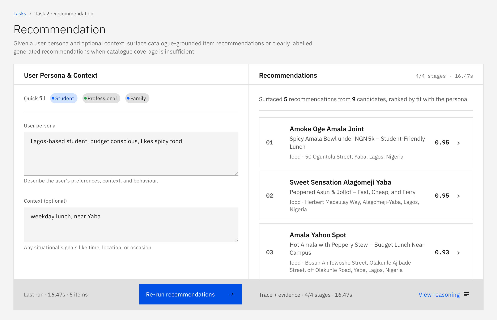
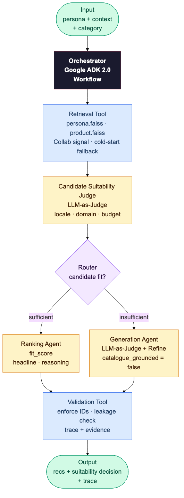

# Recommendation Agent — `src/recommendation`

Task B: given `user_persona` + optional `context` / `category`, return ranked catalogue items
or labelled non-catalogue recommendations when coverage is insufficient.

## Interfaces

**Web UI** — open `http://127.0.0.1:8000/` and navigate to Task 2. Pre-filled Nigerian persona and context examples; shows the 5-stage pipeline trace on each run.



**REST API** — `POST /api/v1/recommendations`

```bash
curl -X POST http://localhost:8000/api/v1/recommendations \
  -H "Content-Type: application/json" \
  -d '{
    "user_persona": "Lagos-based student, budget conscious, likes spicy food",
    "context": "weekday lunch, near Yaba",
    "category": "food",
    "k": 5
  }'
```

| | Field | Type | Description |
|---|---|---|---|
| **Request** | `user_persona` | string | User preferences, context, and behaviour |
| | `context` | string | Situational signals: time, location, occasion |
| | `category` | string\|null | Optional category filter |
| | `k` | int 1–10 | Number of recommendations (default 5) |
| | `candidate_items` | list | Optional — bypasses retrieval for explicit re-ranking |
| **Response** | `recommendation_mode` | string | `catalogue_grounded` · `llm_generated` · `coverage_limited` · `request_supplied_candidates` |
| | `coverage` | object | Suitability status, decision boolean, unsupported signals |
| | `recommendations` | list | Ranked catalogue items with fit_score, headline, reasoning |
| | `generated_recommendations` | list | Non-catalogue fallback items (excluded from NDCG/Hit Rate) |
| | `trace` | list | Per-stage execution log with durations |

## Agent Workflow



```
user_persona + context + category
  │
  ▼
[1] retrieve_candidate_items        ← FAISS dual-axis (persona / product)
  │   or: pass-through if candidate_items supplied in request
  │   returns: CandidateProductSet
  ▼
[2] judge_candidate_coverage        ← DSPy ChainOfThought (Candidate Suitability Judge)
  │   checks: locale fit, domain fit, viable IDs
  │   returns: CoverageDecision {status, allow_concrete, viable_ids, ...}
  ▼
[3] route_by_coverage               ← deterministic code (no LLM)
  │
  ├─ allow_concrete = True
  │     ▼
  │   [4a] rank_and_reason          ← DSPy ChainOfThought
  │         ranks viable_ids only, per-item fit_score + reasoning
  │
  └─ allow_concrete = False
        ▼
      [4b] generate_contextual_recommendations  ← DSPy ChainOfThought + verify
            generates k non-catalogue items, marked catalogue_grounded=false
  │
  ▼
[5] validate_and_build_response     ← deterministic (no LLM)
      enforces product_id existence, strips name-leaked generated items
```

## Why DSPy

- **Typed signatures** make the coverage judge's output (`CoverageDecision`) a first-class
  Python contract, not a string-parsed LLM response. Field mismatches raise at call time.
- **`ChainOfThought`** on `JudgeCoverage` produces a visible `reason` field alongside the
  boolean decision, making the coverage judgment auditable in the trace response.
- **`ChainOfThought`** on `RankAndReason` generates `fit_score`, `headline`, and `reasoning`
  per item in one structured call — eliminates N separate LLM calls for N candidates.
- **GEPA-ready**: `JudgeCoverage` and `RankAndReason` module instructions can be evolved
  offline against coverage-accuracy and NDCG labels without touching application code.

## Key Files

| File | Role |
|---|---|
| `workflow.py` | ADK 2.0 Workflow — branching graph definition |
| `service.py` | `RecommendationService` — orchestrates all 5 stages |
| `openrouter_coverage_judge.py` | DSPy module: `JudgeCoverage` (Candidate Suitability Judge) |
| `openrouter_ranker.py` | DSPy module: `RankAndReason` |
| `openrouter_generated.py` | DSPy module: `GenerateContextualRecommendations` |
| `retrieval.py` | FAISS dual-axis retrieval over `data/index/recommendation/` |
| `schemas.py` | Pydantic contracts: `RecommendationRequest`, `RecommendationResponse`, etc. |

## Reproduce

```bash
# Start server — web UI at http://127.0.0.1:8000/
uv run app-dev

# Build catalogue, persona cases, and FAISS indexes
uv run python scripts/build_recommendation_artifacts.py

# Run offline evaluator (requires LM_MODEL + matching provider env)
uv run --env-file .env python scripts/evaluate_recommendations.py \
  --delay-seconds 5 \
  --output data/eval/results/recommendation_eval_summary.json
```

Artifacts written to `data/index/recommendation/` (persona + product FAISS).
Catalogue: `data/recommendation/product_catalogue.jsonl` (5,102 items).
Persona cases: `data/recommendation/persona_cases.jsonl` (459 cases).
Eval set: `data/eval/recommendation_eval_cases.jsonl` (100 cases, held-out).

## Evaluation Data and Results

The numeric ranking eval uses only the 100 held-out Yelp cases in
`data/eval/recommendation_eval_cases.jsonl`. Those cases are excluded from the
persona retrieval index. The Nigerian catalogue/persona rows are retrieval data
for Nigerian-context behaviour, not held-out numeric eval rows.

Latest saved result: `data/eval/results/recommendation_eval_summary.json`.

| Metric | Value |
|---|---:|
| Cases | `100` |
| Coverage accuracy | `0.86` |
| Hit rate @ 5 | `0.03` |
| Hit rate @ 10 | `0.04` |
| NDCG @ 10 | `0.027703` |
| Median fit score | `0.82` |
| Cold-start case count | `8` |
| Invalid ID count | `0` |
| Average candidate count | `10.02` |

Generated non-catalogue fallback items are excluded from Hit Rate and NDCG. The
eval therefore measures catalogue-grounded ranking quality and coverage
decisions on the held-out Yelp slice, while Nigerian behaviour is validated
through scenario/UI checks and the documented retrieval catalogue.

See [../../README.md](../../README.md) for full setup and Docker instructions.
